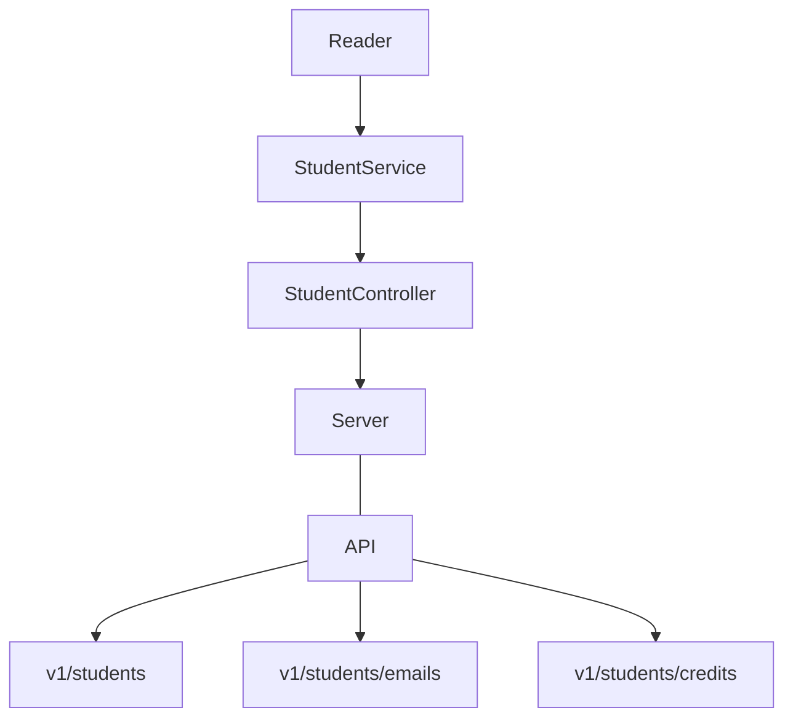
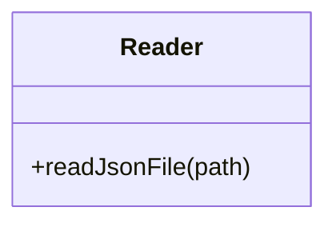

# __Visual Thinking API__

## __Dependencias__
- Express: Utilizado para crear el servidor de la API y procesar el HTTP correspondiente.
- ESLint: Permite estandarizar el formato del código escrito. Utiliza convenciones del lenguaje para evitar errores y facilitar su legibilidad.
- Jest: Para la creación de pruebas unitarias.

## __Diseño de los componentes__

### __Reader__
Reader permitirá leer los archivos de JSON y también dará el formato JSON para el return.

